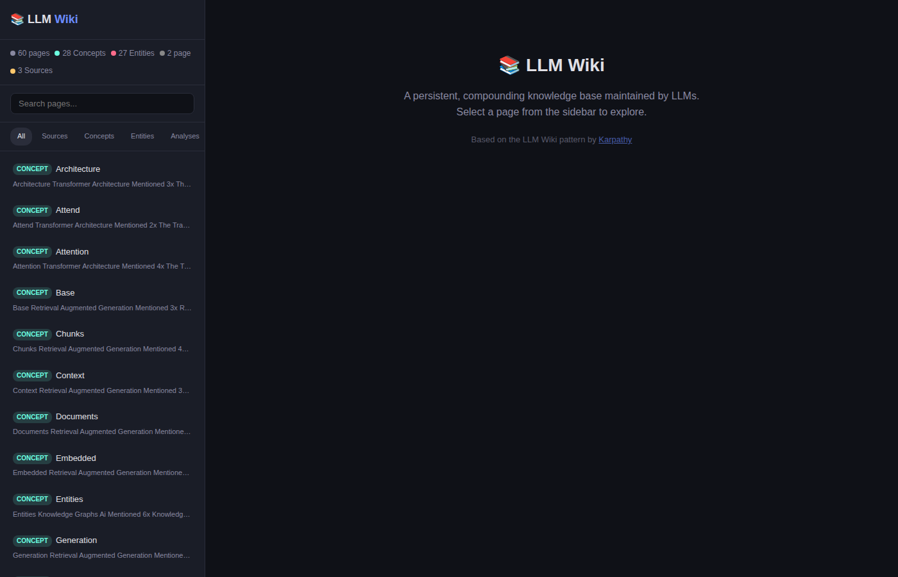
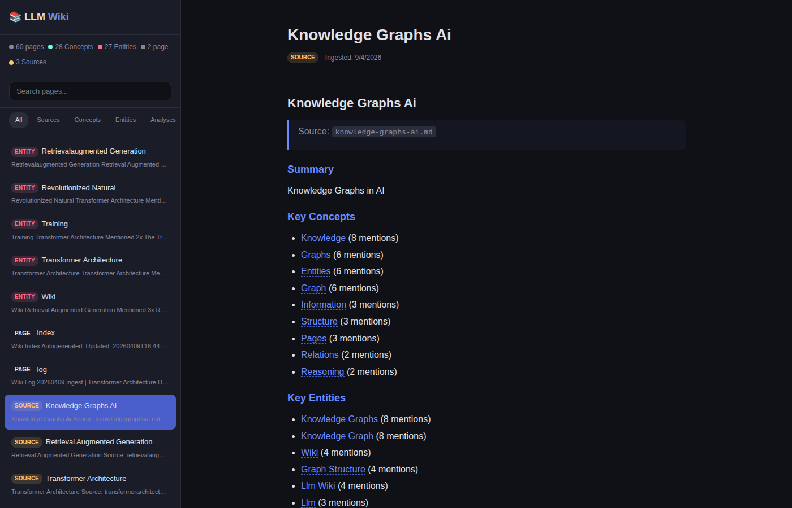
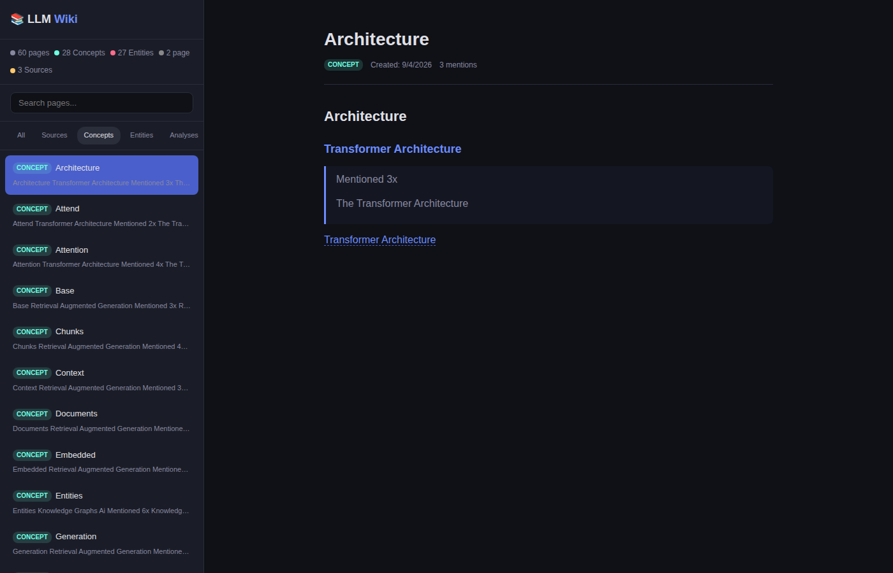

<p align="center">
  
  
  
  
</p>

<h1 align="center">📚 Knowledge Forge</h1>

<p align="center">
  <strong>A persistent, compounding knowledge base maintained by LLMs.</strong><br/>
  Drop sources in. Watch a wiki build itself.
</p>

<p align="center">
  <a href="#quick-start">Quick Start</a> · <a href="#how-it-works">How It Works</a> · <a href="#commands">Commands</a> · <a href="#architecture">Architecture</a> · <a href="#roadmap">Roadmap</a>
</p>

<p align="center">
  <br/>
  <em>Dark-themed web UI with sidebar, type filters, search, and wiki link navigation</em>
</p>

<p align="center">
  <br/>
  <em>Source pages auto-extract concepts and entities with clickable wiki links</em>
</p>

<p align="center">
  <br/>
  <em>Concept pages accumulate cross-references from multiple sources</em>
</p>

---

> **Inspired by [Andrej Karpathy's LLM Wiki pattern](https://gist.github.com/karpathy/442a6bf555914893e9891c11519de94f).**
>
> *"Instead of just retrieving from raw documents at query time, the LLM incrementally builds and maintains a persistent wiki — a structured, interlinked collection of markdown files that sits between you and the raw sources."*
> — Andrej Karpathy

## What It Does

Knowledge Forge takes raw documents and turns them into a living, interconnected wiki. Not a one-shot RAG pipeline — a **compounding knowledge base** that gets richer with every source you feed it.

- 📥 **Ingest** markdown/text sources → auto-extracts concepts and entities
- 🔗 **Links** related pages together with wiki-style `[[links]]`
- 📋 **Indexes** everything into a navigable catalog
- 🔍 **Lints** the wiki: finds orphans, dangling links, missing metadata
- 🌐 **Serves** a dark-themed web UI to browse and explore
- 📝 **Logs** every operation chronologically

## Current Status

**This repo is intentionally positioned as a functional concept implementation.**

That means it already proves the end-to-end pattern:
- raw sources → wiki pages
- cross-linking between pages
- persistent markdown artifact
- index + log
- browseable UI
- health checks / linting

But it does **not** yet implement the full autonomous LLM maintainer vision described by Karpathy.

### What is already real

- A working ingestion pipeline
- Persistent wiki generation on disk
- Concept and entity page creation
- Incremental wiki updates from new sources
- A usable local web UI
- A concrete repo anyone can clone, run, and extend

### What is still missing

- **LLM-powered semantic extraction**
  - Right now extraction is heuristic (word frequency + bigrams), not model-based
- **Natural-language querying**
  - You can browse the wiki, but not yet ask questions like "compare X vs Y" and have answers filed back automatically
- **Contradiction handling**
  - The current version does not yet detect or annotate conflicts between sources
- **Human-in-the-loop workflows**
  - No review queue, approval flow, or source triage loop yet
- **Richer search / retrieval**
  - No BM25/vector search yet, only file-based navigation and simple UI filtering
- **Autonomous maintenance loop**
  - No background agent that continuously ingests, revises, and improves the wiki over time

So the right framing is:

> **Knowledge Forge is a functional prototype of the LLM Wiki pattern, with the core architecture working today and the full LLM-native maintainer loop left as the next step.**

## Why Not Just RAG?

| | RAG | Knowledge Forge |
|---|---|---|
| Knowledge | Re-derived every query | Compiled once, kept current |
| Cross-references | Missing | Built-in `[[wiki links]]` |
| Contradictions | Undetected | Flagged on ingest |
| Accumulation | None — each query is independent | Compounds with every source |
| Maintenance cost | Low (but shallow) | Near zero (LLM does the bookkeeping) |

## Quick Start

```bash
git clone https://github.com/ESJavadex/knowledge-forge.git
cd knowledge-forge
npm install
npm run demo        # bootstrap + 3 sample sources
npm start           # launch web UI at http://localhost:3000
```

Open `http://localhost:3000` and browse the wiki. The sidebar lets you filter by type, search pages, and navigate through wiki links.

## Commands

```bash
node src/cli.js init              # Create folder structure + special files
node src/cli.js demo              # Create 3 sample sources and ingest them
node src/cli.js ingest <file.md>  # Ingest a markdown source into the wiki
node src/cli.js lint              # Health-check: orphans, dangling links, metadata
node src/cli.js serve             # Start the web UI (port 3000)
```

Or via npm scripts:

```bash
npm run init
npm run demo
npm run ingest
npm run lint
npm start
```

## How It Works

### 1. Ingest

Drop a `.md` file into `raw/` and run `ingest`. The engine:

1. Reads the source and extracts a summary
2. Identifies **concepts** (recurring themes) and **entities** (named things, tools, products) using frequency analysis + bigram detection
3. Creates a source summary page in `wiki/sources/`
4. Creates or updates concept pages in `wiki/concepts/`
5. Creates or updates entity pages in `wiki/entities/`
6. Links everything together with `[[wiki links]]`
7. Updates the index and appends to the log

A single source can touch 20+ wiki pages.

### 2. Query (Browse)

Open the web UI and explore. Wiki links are clickable and navigate between related pages. Every page shows its type, creation date, mention count, and linked sources.

### 3. Lint

Run a health check to find:
- 👻 **Orphan pages** — no other page links to them
- 🔗 **Dangling links** — `[[links]]` to pages that don't exist yet
- 📋 **Missing frontmatter** — pages without YAML metadata

## Architecture

```
knowledge-forge/
├── raw/                    # 📥 Immutable source documents (never modified)
│   └── *.md
├── wiki/                   # 📚 LLM-generated knowledge base
│   ├── sources/            # Summary pages for each ingested source
│   ├── concepts/           # Recurring themes and topics
│   ├── entities/           # Named things, tools, products
│   ├── analyses/           # Synthesized answers (user queries filed back)
│   ├── index.md            # Catalog of all pages
│   └── log.md              # Append-only chronological record
├── schema/
│   └── AGENTS.md           # Rules for the wiki maintainer agent
├── src/
│   ├── cli.js              # CLI entry point
│   ├── ingest.js           # Source ingestion + extraction engine
│   ├── lint.js             # Wiki health checker
│   ├── server.js           # Express web UI + API
│   └── utils.js            # Shared utilities
├── public/
│   └── index.html          # Single-page web UI
└── package.json
```

### Three Layers

1. **Raw sources** — Your curated documents. Immutable. The LLM reads from them but never writes to them.
2. **The wiki** — Structured markdown pages maintained entirely by the LLM. Source summaries, concept pages, entity pages, cross-references.
3. **The schema** — Configuration (`AGENTS.md`) that tells the LLM how to structure, maintain, and evolve the wiki.

### Wiki Link Format

Pages reference each other with Obsidian-style `[[Page Name]]` links. The web UI resolves these into clickable navigation. Dangling links (to pages that don't exist yet) are marked with ❓.

## Web UI

The built-in UI features:

- 🌙 Dark theme
- 📂 Sidebar with type filters (Sources, Concepts, Entities, Analyses)
- 🔍 Full-text search across all pages
- 📊 Stats bar showing page counts by type
- 🔗 SPA navigation through wiki links
- 📱 Responsive layout

## Tech Stack

- **Runtime**: Node.js (ESM)
- **Server**: Express.js
- **Markdown**: `marked` (rendering) + `gray-matter` (frontmatter parsing)
- **UI**: Vanilla HTML/CSS/JS — zero build step
- **VCS**: Git (your wiki is a git repo with full history)

## Demo Sources Included

| Source | Concepts | Entities |
|---|---|---|
| Transformer Architecture | 10 | 10 |
| Retrieval-Augmented Generation | 10 | 10 |
| Knowledge Graphs in AI | 10 | 10 |

Run `npm run demo` to generate all of them.

## Roadmap

- [ ] **LLM-powered extraction** — Use an actual LLM API for semantic concept/entity extraction instead of heuristics
- [ ] **Full-text search API** — Integrate `qmd` or similar for proper search as the wiki grows
- [ ] **Query mode** — Ask natural language questions, get synthesized answers with citations
- [ ] **File-and-save** — File query answers back into the wiki as new analysis pages
- [ ] **Obsidian compatibility** — Open the wiki folder directly in Obsidian for graph view
- [ ] **Marp export** — Generate slide decks from wiki content
- [ ] **Dataview queries** — YAML frontmatter + Dataview plugin integration
- [ ] **Contradiction detection** — Flag when new sources contradict existing wiki claims
- [ ] **Web clipper helper** — Easy ingestion from browser extensions
- [ ] **Continuous maintainer mode** — Background agent loop for ingest, refinement, and linting
- [ ] **Review workflows** — Human approval mode for team/internal knowledge bases

## Author

<p align="center">
  <strong>Javier Santos</strong><br/>
  <a href="https://javadex.es">javadex.es</a> · <a href="https://github.com/ESJavadex">GitHub</a>
</p>

<p align="center">
  <em>Head of AI · Electronic Engineer · Building the future, one repo at a time.</em>
</p>

---

## License

MIT — use it, fork it, build on top of it.

---

<p align="center">
  Built with ☕ by <a href="https://javadex.es">Javier Santos</a> · Inspired by <a href="https://gist.github.com/karpathy/442a6bf555914893e9891c11519de94f">Andrej Karpathy</a>
</p>
